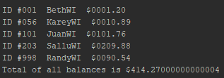

------------------------------------------------------------------------

<h2>PROJECT TITLE: Chapter 13</h2>

# Lesson 1.5
<li>PURPOSE OF PROJECT: Describe some of the files                             </li>
<li>VERSION or DATE: 3/5/2020                                </li>
<li>HOW TO START THIS PROJECT: Open the IntelliJ and run the code                     </li>
<li>USER INSTRUCTIONS: Do the thing and do it well                              </li>

<b>How the Code Works </b>

<u>Paragraph 1</u> 

The program uses the writer method in order to modify text files. It uses writer.write() 
in order to modify a file. The CreateFilesBasedOnText file uses a for statement to write 
each account line.  

<u>Paragraph 2</u> 

The program uses the reader method in order to read text files. It uses reader.readLine() 
to read a file. The ReadStateFile reads users and sets a string to their values for each  
account that it finds. 

 

Try catch statements are important in making sure that the code doesn't stop because of exception, 
with try being the code that is ran and catch being the element that finds exceptions in the code.

 
Image of the accounts :  
 

# Lesson 1.2.1
<li>PURPOSE OF PROJECT: Describe some of the files                             </li>
<li>VERSION or DATE: 3/5/2020                                </li>
<li>HOW TO START THIS PROJECT: Open the IntelliJ and run the code                     </li>
<li>USER INSTRUCTIONS: Do the thing and do it well                              </li>

<b>How the Code Works </b>

